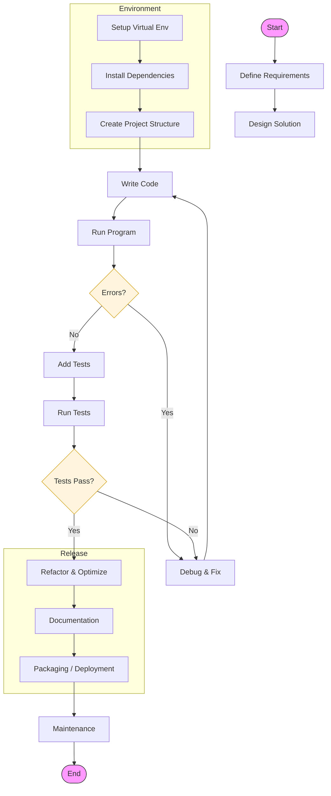

# Workflows 

## Backend 
### Python

- [django-workflow.md](django-workflow.md) - Django project structure, commands, and deployment
- [fast-api-workflow.md](fast-api-workflow.md) - FastAPI development patterns and async setup
- [nodejs-workflow.md](nodejs-workflow.md) - Node.js/NPM/JavaScript workflows
- [laravel-workflow.md](laravel-workflow.md) - PHP/Laravel development flow
- [go-workflow.md](go-workflow.md) - Go modules, testing, and build workflows
- [java-spring-workflow.md](java-spring-workflow.md) - Java/Spring Boot project setup and patterns
- [ruby-rails-workflow.md](ruby-rails-workflow.md) - Ruby on Rails conventions and deployment
- [graphql-workflow.md](graphql-workflow.md) - GraphQL schema design, resolvers, and Apollo setup

### Frontend
- [vuejs-workflow.md](vuejs-workflow.md) - Vue.js project structure and tooling
- [nextjs-workflow.md](nextjs-workflow.md) - Next.js development, SSR, and deployment
- [react-workflow.md](react-workflow.md) - React hooks, state management, and component patterns
- [angular-workflow.md](angular-workflow.md) - Angular CLI, services, and module architecture
- [typescript-workflow.md](typescript-workflow.md) - TS config, types, and migration strategies
- [mobile-workflow.md](mobile-workflow.md) - Cross-platform mobile development (React Native/Flutter)

### DevOps & Infrastructure
- [git-workflow.md](git-workflow.md) - Branching strategies, commit conventions, and PR workflows
- [docker-workflow.md](docker-workflow.md) - Containerization, multi-stage builds, and Docker Compose
- [aws-workflow.md](aws-workflow.md) - AWS services, CLI, and IAM best practices
- [lambda-serverless-workflow.md](lambda-serverless-workflow.md) - Serverless architecture patterns and deployment
- [kubernetes-workflow.md](kubernetes-workflow.md) - K8s manifests, Helm charts, deployment strategies
- [terraform-workflow.md](terraform-workflow.md) - Infrastructure as Code patterns and state management
- [ci-cd-workflow.md](ci-cd-workflow.md) - GitHub Actions, GitLab CI, Jenkins pipelines
- [monitoring-workflow.md](monitoring-workflow.md) - Logging, metrics, APM, and alerting
- [security-workflow.md](security-workflow.md) - SAST, DAST, secret management, vulnerability scanning

### Specialized
- [ml-data-pipeline-workflow.md](ml-data-pipeline-workflow.md) - Machine learning data processing workflows
- [mlops-workflow.md](mlops-workflow.md) - Model training, deployment, monitoring
- [iot-workflow.md](iot-workflow.md) - IoT/Embedded device management, firmware updates
- [web3-workflow.md](web3-workflow.md) - Blockchain/Web3 smart contracts, wallet integration
- [game-dev-workflow.md](game-dev-workflow.md) - Unity/Unreal engine workflows
- [ar-vr-workflow.md](ar-vr-workflow.md) - AR/VR development patterns

### Data & Databases 
- [database-workflow.md](database-workflow.md) - PostgreSQL/MySQL schema migrations, backups, optimization
- [nosql-workflow.md](nosql-workflow.md) - MongoDB/NoSQL document DB patterns, indexing, aggregation
- [caching-workflow.md](caching-workflow.md) - Redis caching strategies, invalidation patterns
- [data-engineering-workflow.md](data-engineering-workflow.md) - ETL/ELT, data lakes, pipeline orchestration
- [event-streaming-workflow.md](event-streaming-workflow.md) - Apache Kafka event-driven architectures

### Quality & Process
- [testing-workflow.md](testing-workflow.md) - Unit, integration, E2E testing across stacks
- [code-review-workflow.md](code-review-workflow.md) - PR templates, review checklist, standards
- [documentation-workflow.md](documentation-workflow.md) - Docs-as-code, API docs, knowledge sharing
- [performance-workflow.md](performance-workflow.md) - Profiling, benchmarking, optimization

### Platform-Specific
- [azure-workflow.md](azure-workflow.md) - Azure services, ARM templates, AKS
- [gcp-workflow.md](gcp-workflow.md) - Google Cloud services, GKE, Cloud Functions
- [heroku-workflow.md](heroku-workflow.md) - Heroku deployment, add-ons, scaling
- [static-hosting-workflow.md](static-hosting-workflow.md) - Vercel/Netlify JAMstack deployment workflows
