# 🐳 Docker Workflow

## Complete Docker Development Flow
This flowchart shows the end-to-end Docker workflow from project start to production deployment, including development, testing, and CI/CD integration.

## Docker Container Lifecycle
Timeline showing the complete lifecycle of a Docker container from build to cleanup, highlighting key stages and commands.

## Multi-Stage Build Process
Visualizes the multi-stage build pattern where different stages handle building vs runtime, resulting in smaller, more secure production images.

## Docker Compose Services Architecture
Shows a typical microservices architecture using Docker Compose, including load balancing, databases, caching, and monitoring services.

## Development vs Production Flow
Compares development and production Docker workflows side-by-side, highlighting different priorities and configurations for each environment.

## CI/CD Pipeline with Docker
Complete CI/CD pipeline visualization showing automated testing, security scanning, and deployment stages triggered by Git pushes.

```mermaid
graph TD
    A[Code Push to Git] --> B{Trigger CI/CD Pipeline}
    B --> C[1. Checkout Code<br>Get latest changes]
    C --> D[2. Docker Build<br>Create container image]
    D --> E[3. Run Tests<br>Unit, integration, e2e]
    E --> F{4. Quality Gate<br>All Tests Pass?}
    
    F -->|✅ Yes| G[5. Security Scan<br>Check for vulnerabilities]
    F -->|❌ No| Z[❌ Pipeline Failed<br>Notify developers]
    
    G --> H{6. Security Gate<br>No Critical Vulnerabilities?}
    H -->|✅ Yes| I[7. Tag & Push Image<br>Version and store in registry]
    H -->|⚠️ No| Y[⚠️ Security Alert<br>Block deployment, notify]
    
    I --> J{8. Environment Routing<br>Which branch?}
    
    J -->|🌿 Develop Branch| K[9. Deploy to Staging<br>Pre-production environment]
    J -->|🎯 Main Branch| L[10. Deploy to Production<br>Live users]
    
    K --> M[11. Integration Tests<br>Validate in staging]
    M --> N{12. Staging Verification<br>All systems go?}
    N -->|✅ Yes| L
    N -->|❌ No| O[13. Rollback Staging<br>Automatic recovery]
    
    L --> P[14. Health Checks<br>Validate deployment]
    P --> Q[15. Monitoring<br>Performance tracking]
    Q --> R[✅ Success 🎉<br>Deployment complete]
    
    style R fill:#2ecc71
    style Z fill:#e74c3c
    style Y fill:#f39c12
```

## Docker Network Architecture
Visualizes Docker networking concepts showing how containers communicate internally and externally through different network types.

## Daily Docker Commands Flow
State diagram showing the sequence of Docker commands used in daily development work and release processes.

```mermaid
flowchart TD
    A[Start development day] --> B[Build: docker build .]
    B --> C[Run: docker run -p 3000:3000]
    C --> D[Develop: Code with live reload]
    D --> E[Test: docker exec app npm test]
    E --> F[Commit: Save changes to Git]
    
    F --> G[Push: docker push registry/app:dev]
    G --> H[Deploy staging: docker stack deploy]
    H --> I[Verify: docker service ls]
    I --> J{Ready for production?}
    
    J -->|Yes| K[Tag: docker tag app:latest app:v1.2.3]
    J -->|No| L[Continue development]
    L --> B
    
    K --> M[Push prod: docker push registry/app:v1.2.3]
    M --> N[Deploy prod: docker stack deploy -c production.yml]
    N --> O[Monitor: docker stats]
    O --> P[✅ Release complete]
    
    style A fill:#3498db
    style F fill:#9b59b6
    style P fill:#2ecc71
    style L fill:#f39c12
```

## Docker Security Workflow
Security-focused workflow showing best practices for securing Docker images and containers throughout the development lifecycle.

